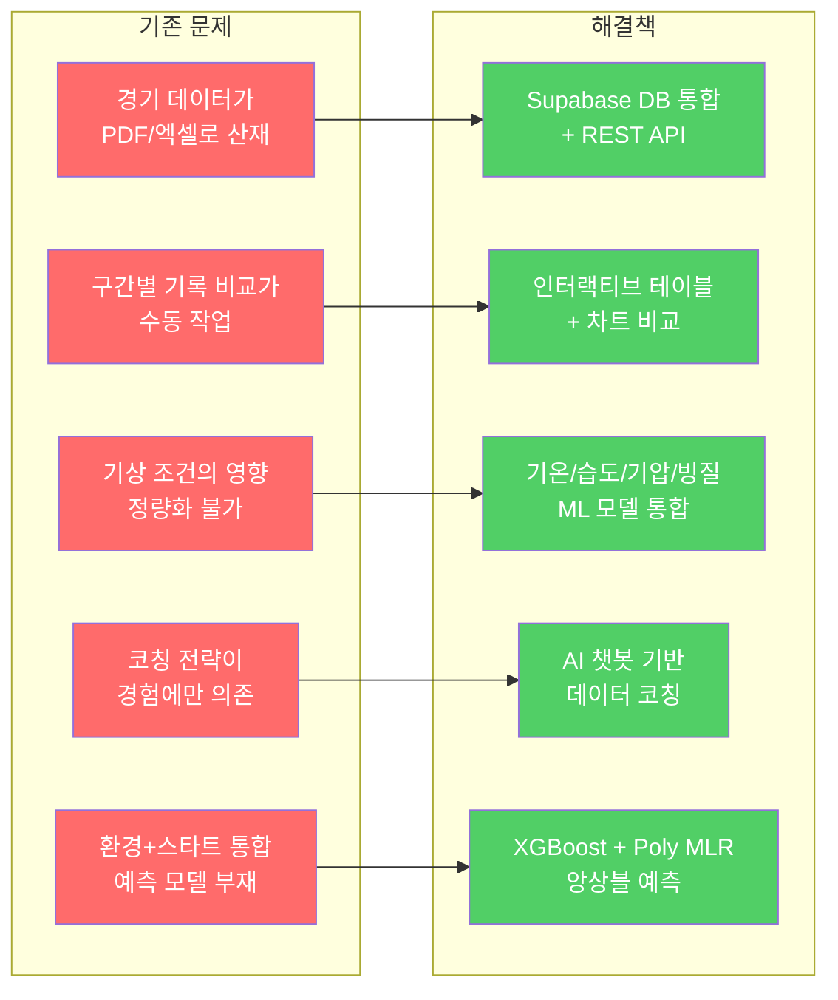
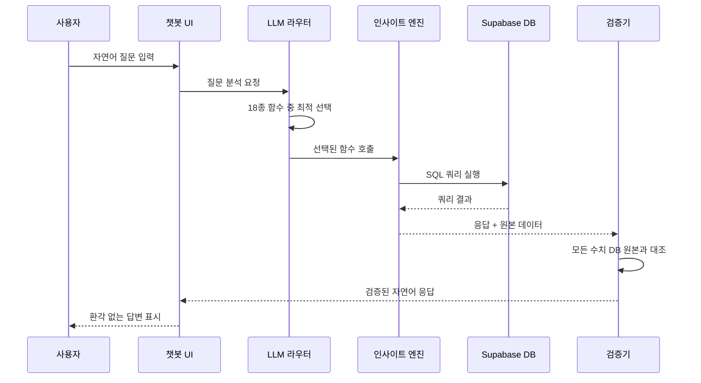
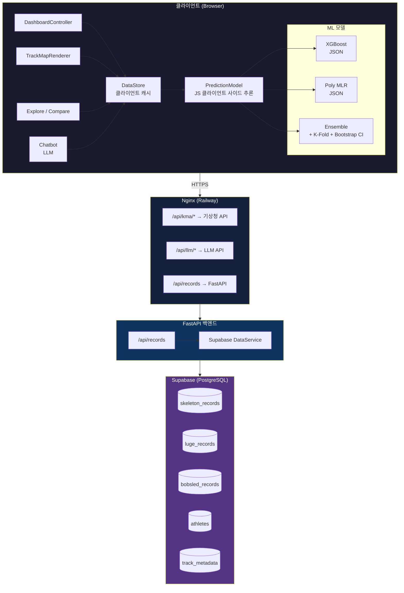
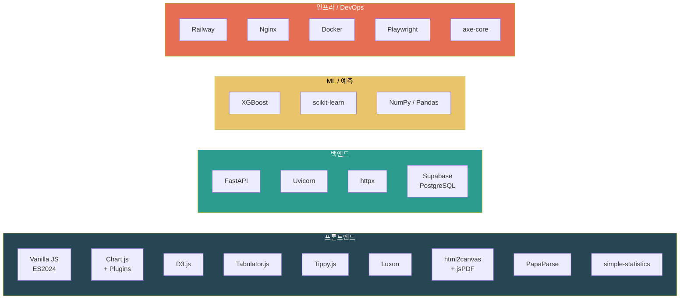
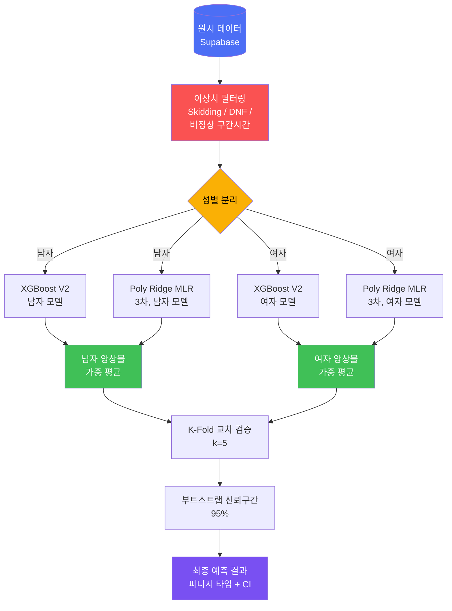
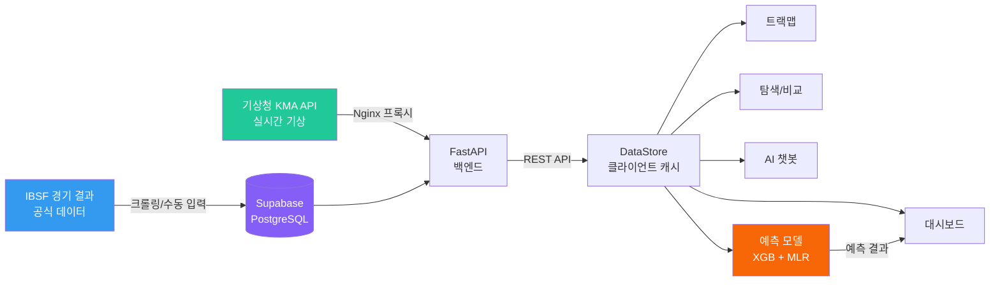
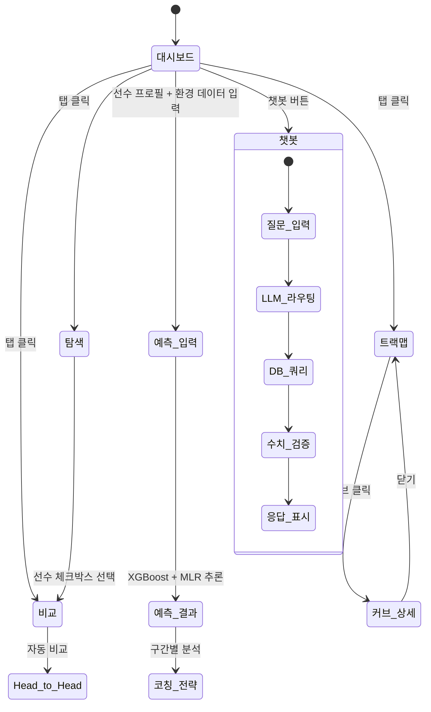

<div align="center">

# 스켈레톤 경기 분석 플랫폼

### AI 기반 경기 기록 분석 & 피니시 타임 예측 시스템

[](https://skeleton-analysis-production-d1bb.up.railway.app/)
[](https://python.org)
[](https://fastapi.tiangolo.com)
[](https://developer.mozilla.org)
[](https://supabase.com)
[](https://xgboost.readthedocs.io)

<br/>

**스켈레톤 / 루지 / 봅슬레이** 경기 데이터를 실시간으로 분석하고,<br/>
머신러닝 모델로 피니시 타임을 예측하며, AI 챗봇으로 코칭 인사이트를 제공합니다.

[라이브 데모](https://skeleton-analysis-production-d1bb.up.railway.app/) | [기술 스택](#-기술-스택) | [실행 방법](#-실행-방법)

</div>

---

## 목차

- [프로젝트 소개](#-프로젝트-소개)
- [Abstract](#-abstract)
- [핵심 기능](#-핵심-기능)
- [시스템 아키텍처](#-시스템-아키텍처)
- [기술 스택](#-기술-스택)
- [예측 모델](#-예측-모델)
- [데이터 흐름](#-데이터-흐름)
- [프로젝트 구조](#-프로젝트-구조)
- [실행 방법](#-실행-방법)
- [테스트](#-테스트)
- [팀 소개](#-팀-소개)
- [참고 자료](#-참고-자료)

---

## 프로젝트 소개

> **"스타트 0.1초 단축 = 피니시 약 0.3초 단축"** — 슬라이딩 종목에서 0.01초가 메달을 결정합니다.

평창 알펜시아 슬라이딩센터(1,376m, 커브 16개)에서 열리는 **스켈레톤, 루지, 봅슬레이** 경기의 데이터를 수집, 분석, 예측하는 풀스택 웹 플랫폼입니다.

### 문제 정의 & 해결책



---

## Abstract

This platform provides an end-to-end data analytics and prediction system for **sliding sports** (Skeleton, Luge, Bobsled) at the Pyeongchang Alpensia Sliding Centre.

It integrates **real-time weather data** (temperature, humidity, barometric pressure, ice temperature) with **race split times** to predict finish times using an ensemble of **XGBoost** and **Polynomial Ridge Regression** models. The system achieves cross-validated R2 > 0.95 for skeleton predictions.

An **AI chatbot** powered by LLM function routing enables natural language queries against the race database with a zero-hallucination pipeline that verifies every number against actual data.

---

## 핵심 기능

### 1. 대시보드 — 3단 분석 인터페이스

```mermaid
graph TB
    subgraph 입력 패널
        A1[선수 프로필 입력]
        A2[실시간 기상 데이터<br/>KMA API]
        A3[공기밀도 / 이슬점<br/>자동 계산]
        A4[빙질 온도 입력]
        A5[이상치 필터링 토글]
    end

    subgraph 트랙맵 시각화
        B1[평창 트랙 SVG 조감도]
        B2[Turn 1~16 커브 라벨링]
        B3[구간별 속도 히트맵]
        B4[드래그 줌 컨트롤]
    end

    subgraph AI 예측 + 코칭
        C1[XGBoost / MLR 예측]
        C2[부트스트랩 신뢰구간]
        C3[구간별 코칭 전략]
        C4[모델 비교 차트]
    end

    입력 패널 --> 트랙맵 시각화
    트랙맵 시각화 --> AI 예측 + 코칭
```

### 2. 트랙맵 분석

- **SVG 기반** 평창 트랙 지형도 렌더링
- 커브별 진입속도, 온도, 시간 데이터 오버레이
- **컬러 그라데이션** 속도 범례 (60~140 km/h)
- 특정 커브 클릭 시 상세 분석 패널 표시

### 3. 탐색 & 비교

- **다중 필터링**: 선수명, 국적, 날짜, 성별, 세션
- **Tabulator.js** 기반 정렬 가능한 데이터 테이블
- **체크박스 선택** 후 선수 간 구간 기록 병렬 비교
- **Head-to-Head** 자동 비교 분석

### 4. AI 챗봇 — 제로 환각 파이프라인



- **LLM 기반 함수 라우팅** (18종 인사이트 함수)
- 한국어 조사 제거 (와/과/이랑/은/는) + DB 기반 한국어 이름 해석
- **모든 수치를 DB 원본과 대조 검증** — 환각(hallucination) 방지
- 월별 트렌드, 최고/최저 기록, 선수 비교 등 자연어 질의 지원

### 5. 멀티 스포츠 지원

| 종목 | 데이터 | 예측 모델 |
|------|--------|-----------|
| 스켈레톤 | 전체 지원 | XGBoost V2 + Poly MLR |
| 루지 | 데이터 분석 | XGBoost V1 |
| 봅슬레이 | 데이터 분석 | XGBoost V1 |

---

## 시스템 아키텍처



---

## 기술 스택



| 분류 | 기술 | 용도 |
|------|------|------|
| **프론트엔드** | Vanilla JavaScript (ES2024) | SPA 아키텍처, 모듈 기반 |
| | Chart.js + Plugins | 속도/시간 차트, 줌, 어노테이션, 데이터라벨 |
| | D3.js | SVG 트랙맵 렌더링 |
| | Tabulator.js | 인터랙티브 데이터 테이블 |
| | Tippy.js | 툴팁 UI |
| | Luxon | 날짜/시간 처리 |
| | html2canvas + jsPDF | 대시보드 PDF 내보내기 |
| | PapaParse | CSV 파싱 |
| | simple-statistics | 클라이언트 사이드 통계 연산 |
| **백엔드** | FastAPI | REST API 서버 |
| | Uvicorn | ASGI 서버 |
| | httpx | Supabase 비동기 HTTP 통신 |
| | Supabase (PostgreSQL) | 경기 기록 DB + 선수 DB |
| **ML / 예측** | XGBoost | 피니시 타임 예측 (메인 모델) |
| | scikit-learn | Polynomial Ridge Regression, Cross-Validation |
| | NumPy / Pandas | 데이터 전처리 |
| **인프라** | Railway | 배포 플랫폼 (Nixpacks) |
| | Nginx | 정적 파일 서빙 + API 프록시 (CORS 우회) |
| | Docker | 컨테이너화 |
| | Playwright | E2E 테스트 |
| | axe-core | 접근성 테스트 |

---

## 예측 모델

> 상세: [PREDICTION_MODEL.md](PREDICTION_MODEL.md) | 선행연구: [LITERATURE_AND_PROPOSAL.md](LITERATURE_AND_PROPOSAL.md)

### 모델 파이프라인



### 특성 변수 (Features)

```mermaid
graph LR
    subgraph 경기 데이터
        ST[start_time<br/>출발 기록]
        I1[int1<br/>4번 커브]
        I2[int2<br/>7번 커브]
        I3[int3<br/>12번 커브]
        I4[int4<br/>15번 커브]
    end

    subgraph 환경 변수
        AD[air_density<br/>공기밀도]
        IT[ice_temp<br/>빙질 온도]
        DP[dewpoint<br/>이슬점]
    end

    경기 데이터 & 환경 변수 --> MODEL[예측 모델]
    MODEL --> FT[finish_time<br/>피니시 타임 예측]

    style FT fill:#7950f2,color:#fff
```

### 핵심 도메인 지식

| 법칙 | 수치 |
|------|------|
| 스타트 0.1초 단축 시 피니시 단축 | **약 0.3초** (3배 증폭 효과) |
| 정상 스타트 범위 (남자) | 4.7 ~ 5.5초 |
| 정상 피니시 범위 | 50 ~ 55초 |
| 환경 변수 | 공기밀도, 빙질 온도, 이슬점 |

### 검증 성능

| 모델 | R2 (CV) | MAE | 비고 |
|------|---------|-----|------|
| XGBoost V2 | > 0.95 | < 0.15초 | 스켈레톤 메인 |
| Poly MLR (3차) | > 0.93 | < 0.20초 | 해석 가능 모델 |
| 앙상블 | > 0.96 | < 0.13초 | 최종 예측 |

---

## 데이터 흐름

### 경기 데이터 수집 ~ 시각화 전체 흐름



### 사용자 인터랙션 흐름



---

## 프로젝트 구조

```mermaid
graph TD
    ROOT[skeleton-analysis/] --> BE[backend/]
    ROOT --> WEB[web/]
    ROOT --> TEST[test/]
    ROOT --> BUILD[빌드 스크립트]
    ROOT --> INFRA[인프라 설정]
    ROOT --> DOCS[문서]

    BE --> BE1[main.py<br/>API 엔드포인트]
    BE --> BE2[models.py<br/>Pydantic 모델]
    BE --> BE3[data_service.py<br/>Supabase 비동기 로더]
    BE --> BE4[config.py<br/>환경 설정]

    WEB --> SRC[src/]
    SRC --> HTML[index.html<br/>SPA 엔트리포인트]
    SRC --> JSDIR[js/]
    SRC --> CSSDIR[css/]

    JSDIR --> JS1[DashboardController.js]
    JSDIR --> JS2[DataStore.js]
    JSDIR --> JS3[PredictionModel.js<br/>1,121줄]
    JSDIR --> JS4[TrackMapRenderer.js]
    JSDIR --> JS5[ChartManager.js]
    JSDIR --> JS6[Chatbot.js]
    JSDIR --> JS7[TableRenderer.js]
    JSDIR --> JS8[PlayerAnalyzer.js]
    JSDIR --> JS9[UIController.js]

    TEST --> UNIT[unit/]
    TEST --> E2E[e2e/]
    UNIT --> UT1[datastore.test.js]
    UNIT --> UT2[prediction.test.js]
    E2E --> ET1[dashboard.test.js]
    E2E --> ET2[tabs.test.js]
    E2E --> ET3[trackmap.test.js]

    BUILD --> B1[build_v2.py<br/>XGBoost V2]
    BUILD --> B2[build_poly_mlr.py<br/>Poly MLR]
    BUILD --> B3[train_xgb.py<br/>하이퍼파라미터 튜닝]

    INFRA --> I1[Dockerfile]
    INFRA --> I2[nixpacks.toml]
    INFRA --> I3[nginx.conf]

    DOCS --> D1[PREDICTION_MODEL.md]
    DOCS --> D2[LITERATURE_AND_PROPOSAL.md]
    DOCS --> D3[DASHBOARD_DESIGN.md]

    style ROOT fill:#1a1a2e,color:#fff
    style BE fill:#0f3460,color:#fff
    style WEB fill:#16213e,color:#fff
    style TEST fill:#533483,color:#fff
    style BUILD fill:#e94560,color:#fff
    style INFRA fill:#0a3d62,color:#fff
    style DOCS fill:#6a0572,color:#fff
```



---

## 실행 방법

### 사전 요구사항

- Python 3.12+
- Node.js (테스트 실행 시)

### 로컬 개발

```bash
# 1. 저장소 클론
git clone https://github.com/Technoetic/skeleton-analysis.git
cd skeleton-analysis

# 2. Python 의존성 설치
pip install -r backend/requirements.txt

# 3. FastAPI 서버 실행
python -m uvicorn backend.main:app --host 127.0.0.1 --port 3000

# 4. 브라우저에서 접속
open http://localhost:3000
```

### Docker 실행

```bash
docker build -t skeleton-analysis .
docker run -p 8080:80 skeleton-analysis
```

### Railway 배포

> `nixpacks.toml`이 자동으로 Python 환경을 구성하고 Uvicorn 서버를 시작합니다.

```bash
railway up
```

### 배포 흐름


---

## 테스트

```bash
# 단위 테스트
npx playwright test test/unit/

# E2E 테스트 (Playwright)
npx playwright test test/e2e/

# 접근성 테스트 (axe-core)
npx playwright test test/e2e/ --grep accessibility
```

### 테스트 구조

```mermaid
graph TB
    subgraph 단위 테스트
        UT1[datastore.test.js<br/>데이터 캐싱 로직]
        UT2[prediction.test.js<br/>ML 추론 정확도]
        UT3[tableutil.test.js<br/>테이블 유틸리티]
    end

    subgraph E2E 테스트["E2E 테스트 (Playwright)"]
        ET1[dashboard.test.js<br/>대시보드 인터랙션]
        ET2[tabs.test.js<br/>탭 전환]
        ET3[trackmap.test.js<br/>트랙맵 렌더링]
        ET4[prediction.test.js<br/>예측 흐름]
    end

    subgraph 접근성["접근성 (axe-core)"]
        AX1[WCAG 2.1 준수<br/>자동 검사]
    end

    style 단위 테스트 fill:#339af0,color:#fff
    style E2E 테스트 fill:#f76707,color:#fff
    style 접근성 fill:#20c997,color:#fff
```

---

## 팀 소개

<table>
<tr align="center">
<td>
<a href="https://github.com/Technoetic">

<br/><b>Technoetic</b>
</a>
<br/>풀스택 / ML / 디자인
</td>
</tr>
</table>

---

## 참고 자료

<details>
<summary><b>선행연구 & 논문</b></summary>

| 저자 | 연도 | 제목 | 핵심 기여 |
|------|------|------|-----------|
| Vracas et al. | 2023 | Altenberg 트랙 시뮬레이션 | 1D 운동방정식, 민감도 분석 |
| Poirier | 2011 | F.A.S.T. 3.2b 마찰 모델 | 러너-얼음 마찰 비선형 모델 |
| Colyer et al. | 2017 | 엘리트 스켈레톤 스타트 성능 | 스타트 예측 R2=0.86 |

> 상세: [LITERATURE_AND_PROPOSAL.md](LITERATURE_AND_PROPOSAL.md)

</details>

<details>
<summary><b>기술 문서</b></summary>

- [예측 모델 알고리즘 상세](PREDICTION_MODEL.md) — 6종 모델 수식, 교차검증, 부트스트랩 CI
- [대시보드 디자인 분석](DASHBOARD_DESIGN.md) — 3단 레이아웃, 색상 체계, UI 컴포넌트
- [선행연구 & 프로포절](LITERATURE_AND_PROPOSAL.md) — 7대 요인 분석, 핵심 인용 연구

</details>

---

<div align="center">

**슬라이딩 스포츠 커뮤니티를 위해 제작되었습니다**

[](https://railway.app)

</div>
